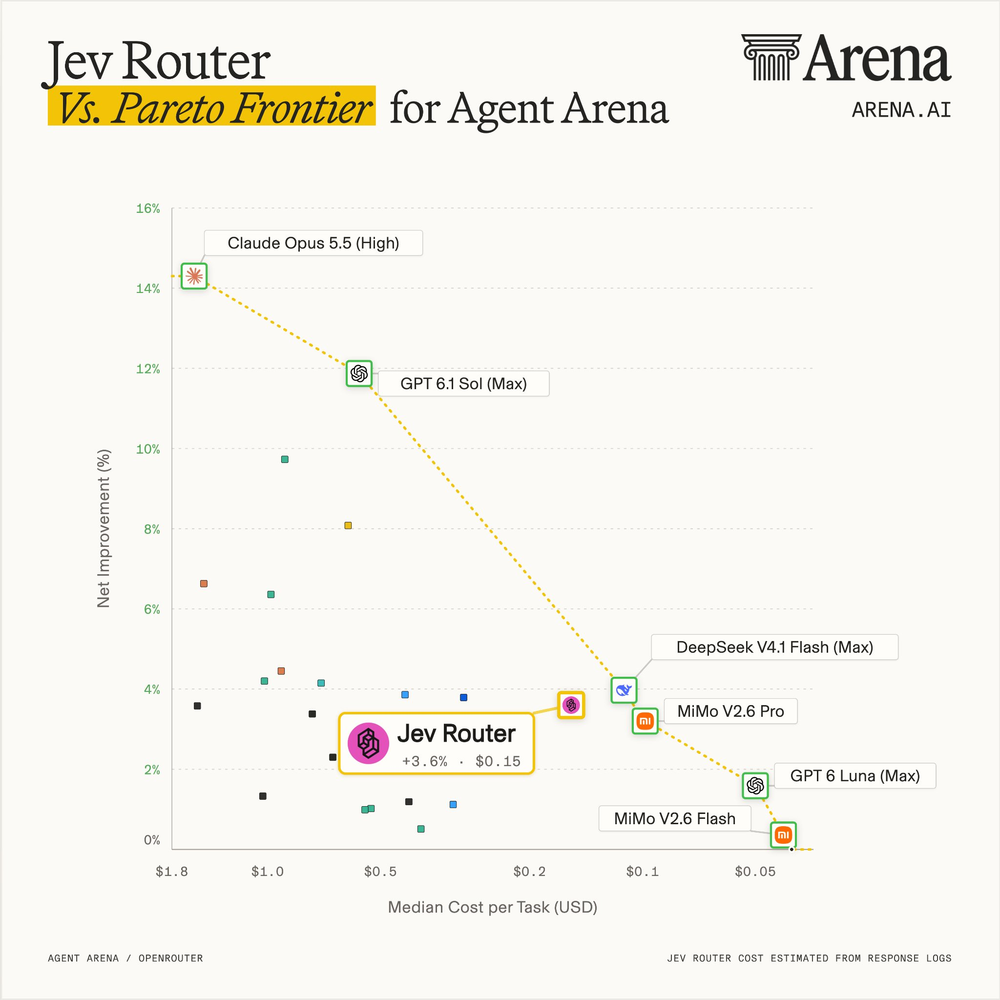
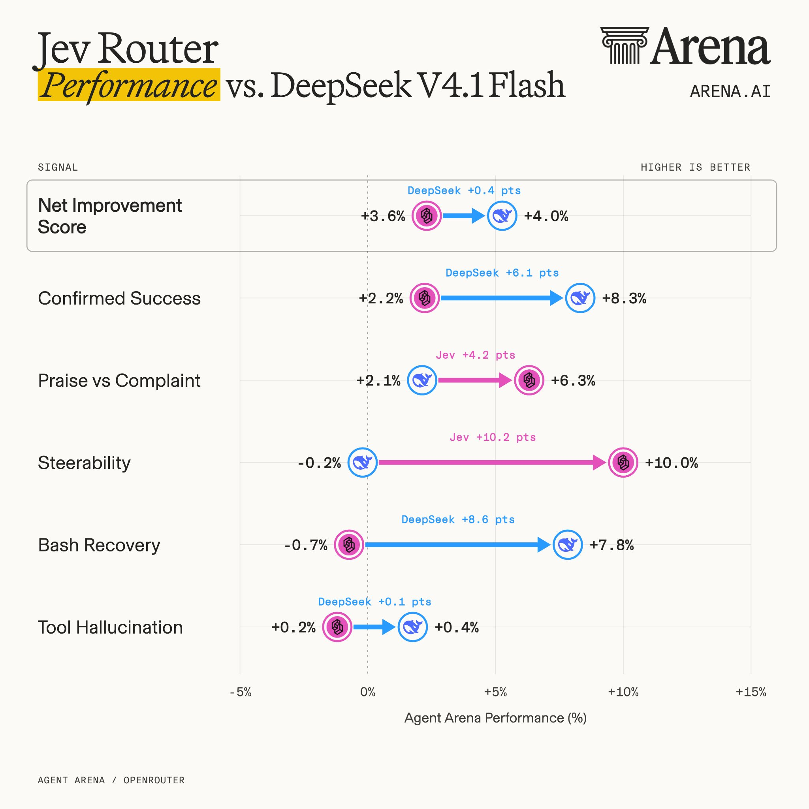
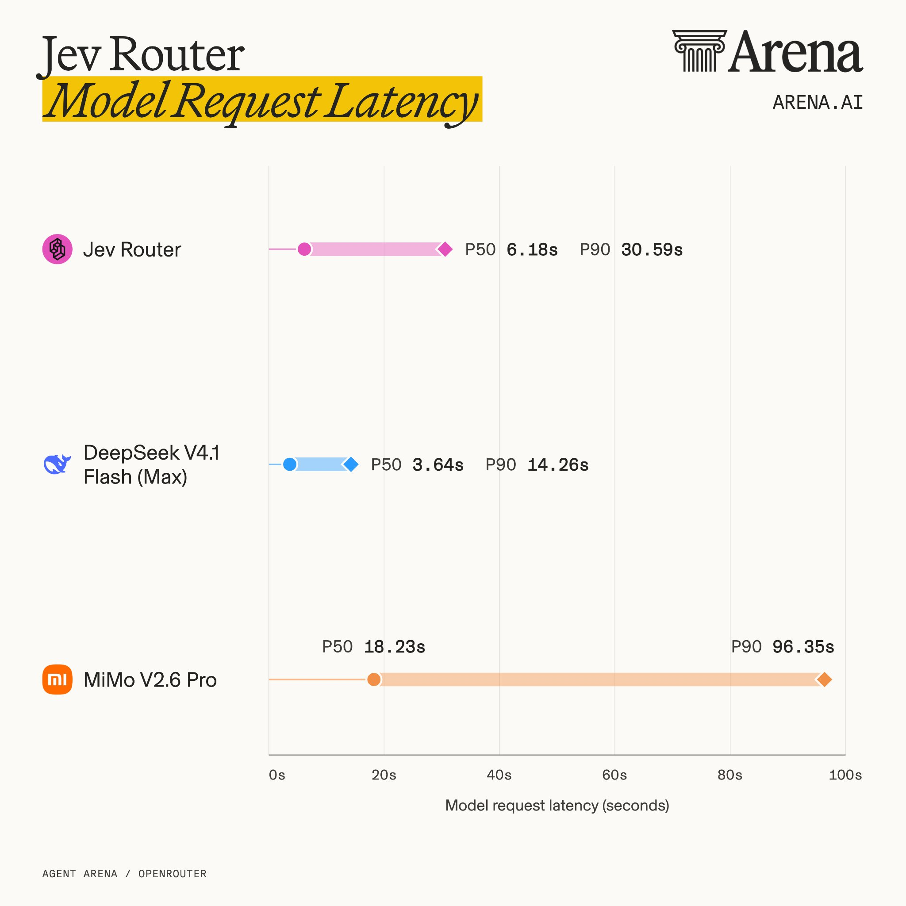

# Arena 独立实测 Jev Router：4,700+ 真实智能体会话的第三方成绩单

> 原文：[X @arena 推文串](https://x.com/arena/status/2107961555363213482) · 推文串全 6 条（含 1 条用户跟帖）· @arena（Arena.ai）· 2026-10-07
>
> 译文为社区学习用途的非官方中文翻译，版权归原作者所有。

---

## 作者与来源

**Arena.ai（@arena）**，X 约 23.3 万关注者，官方简介：「AI 与真实世界相遇的地方。我们通过社区驱动的评测来测量并推进 AI 前沿。」它就是知名大模型竞技场 **LMArena**（原 UC Berkeley LMSYS Chatbot Arena）背后的运营公司——靠真实用户盲测投票给模型排名，是业界引用最多的第三方评测机构之一。**Agent Arena** 是其面向智能体（agentic）任务的评测线：模型在真实会话里跑完整任务，从任务成败、成本、延迟到用户反馈全部记录。本次评测经 OpenRouter 采集真实模型调用，覆盖 **4,700+ 会话、85,011 次模型调用**（图表脚注口径）；Jev Router 的成本从响应日志估算。

被测对象 **Jev Router** 是 TypeSafe 的模型路由方案：用 Jev 决策模型判断「这次调用该交给哪个 LLM」。这是 Jev 路由用法**第一次拿到大规模独立第三方实测**——此前社区只有从业者自报（本库 24 号的「账单降 90%」）和 Agent Harness 论文的模拟环境数据（99.5% 流量路由到便宜模型），这次是真实会话上的成绩单，结论也冷静得多。

**收录说明**：主帖与 4 条自跟帖全译，另收录 1 条用户跟帖（@tomdringer 的提问，截至快照未见官方回复）。

---

## 正文（推文串全译）

### 1/5 主帖

我们评测了 @typesafeai 的 **Jev Router**，在 Agent Arena 上进行。

横跨 **4,700 多个真实智能体会话**的测试显示：

1. **Jev Router 没有改进当前的帕累托前沿。** 要达到与 DeepSeek V4.1 Flash（Max）相近的性能，它的成本高出 38%，模型请求的中位延迟是后者的 1.7 倍。
2. **不过它路由到的基本都是帕累托有效的模型。** 选得最多的是 DeepSeek V4.1 Flash，GPT-6.1 Sol 和 GPT-6 Luna 也是常见选择。
3. **Jev Router 的关键强项是可引导性（steerability）。** 其 +10% 的得分几乎追平 Claude Opus 5.5（High）的 +10.48——这凸显了 Jev 在用户给反馈后能有效路由到更强 LLM 的能力。

更多发现见下方推文串。

### 2/5 路由分布

Jev 优先考虑效率，把大多数调用路由给了 DeepSeek V4.1 Flash——占全部模型调用的 **28.1%**。

它对 OpenAI 模型的偏好明显多于 Anthropic 的模型。**GPT-6 Astra 是第二受欢迎的选择（23.5%）**，其次是其他 GPT 模型：Sol（22.8%）和 Luna（11.1%）。

### 3/5 榜单模拟：与 DeepSeek 正面对比

如果把 Jev Router 放上 Agent Arena 排行榜，它会拿到 **+3.6% 的净改进得分**，每任务中位成本 **$0.155**。

它的排名会低于 **DeepSeek V4.1 Flash**（正是它路由最多的模型），但在这两项上击败 DeepSeek：**可引导性**（+10.0% 对 −0.2%）和**表扬与抱怨比**（+6.3% 对 +2.1%）。

DeepSeek 更强的地方在：**确认成功率**（+8.3% 对 +2.2%）、**Bash 恢复**（+7.8% 对 −0.7%）和**工具幻觉**（+0.4% 对 +0.2%）。

这里的关键信号是可引导性——它证明了 Jev 响应用户纠正的强大能力。实际上，路由器的得分距离 Claude Opus 5.5（High）并不远，只差 0.48 个百分点。

### 4/5 延迟对比

最后，把路由器的端到端请求延迟与邻近的帕累托最优模型比较。

结果显示 **Jev Router 的中位延迟更高：6.18 秒**，对比 DeepSeek V4.1 Flash（Max）的 3.64 秒。

差距在 P90（最慢的 10% 请求）进一步拉大：**Jev Router 要 30.59 秒，DeepSeek 只要 14.26 秒**。

### 5/5 总结

总结一下：**Jev Router 做的是聪明的选择**——它最常用的 5 个模型里有 4 个在帕累托前沿上，可引导性也显著地强。

但这些加起来还不构成更好的权衡。**直接调用 DeepSeek V4.1 Flash 就能以更低的成本和延迟拿到相近的性能。**

我们的结果说明了为什么模型路由很难：同时平衡任务成功率、可引导性、成本和延迟，仍然是一个悬而未决的挑战。

---

### 跟帖（用户提问）

**Tom Dringer（@tomdringer）** 提问：

> 如果你在一个会话中途开始反驳它、给它施压，它的路由行为会不会不一样？这是我最想戳一戳的点。

*（截至快照时间 2026-10-08，官方尚未回复。）*

---

## 译注

- **帕累托前沿（Pareto frontier）**：在「成本-性能」散点图上，不存在另一个模型既比它便宜又比它强的那批模型。Arena 的结论 1 说的是：Jev Router 本身没有站上这条线——同样的性能，直接用 DeepSeek 更便宜更快。
- **可引导性（steerability）**：用户给出纠正或反馈后，系统随之改进的程度。Agent Arena 用负反馈会话前后的表现变化来度量。路由方案的理论优势之一就是「发现用户不满 → 换更强的模型」，实测证明这条路确实走得通（+10.0%），这也是 Jev Router 本次最站得住的卖点。
- **指标名直译对照**：Confirmed Success（确认成功：任务被实际验证完成）、Praise vs Complaint（表扬与抱怨比：用户正负反馈之比）、Bash Recovery（Bash 恢复：命令行出错后自我修复）、Tool Hallucination（工具幻觉：调用不存在或不适用的工具）。
- **与本库其他条目的对照，值得并排读**：
  - **24 号**（polydao 宣称路由「账单降 90%」，从业者自报口径）——本篇独立实测给出的答案冷峻得多：与直接调 DeepSeek 相比**贵 38%、慢 1.7 倍**。
  - **Agent Harness 论文**（arXiv 2610.02267，模拟环境里 99.5% 流量路由到便宜模型）——两份材料测的层面不同：论文证明「省钱来自架构分层」，Arena 证明「路由器本身难成性价比赢家」。合读的结论：路由的价值在延迟与弹性调度，不在单点降本。
  - **30 号**（情酱的对照实验方法论）——Arena 这次是同一精神在机构侧的版本：真实会话、大样本、可复算。
- **成本口径**：图中 Jev Router 的成本由响应日志估算（图 1 脚注），与厂商计费口径可能有出入；测试期间 Sol 6.1 上线（图 2 脚注），说明候选模型池在评测中段发生过变化。
