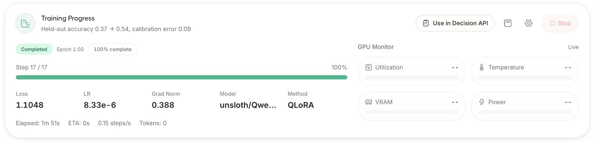
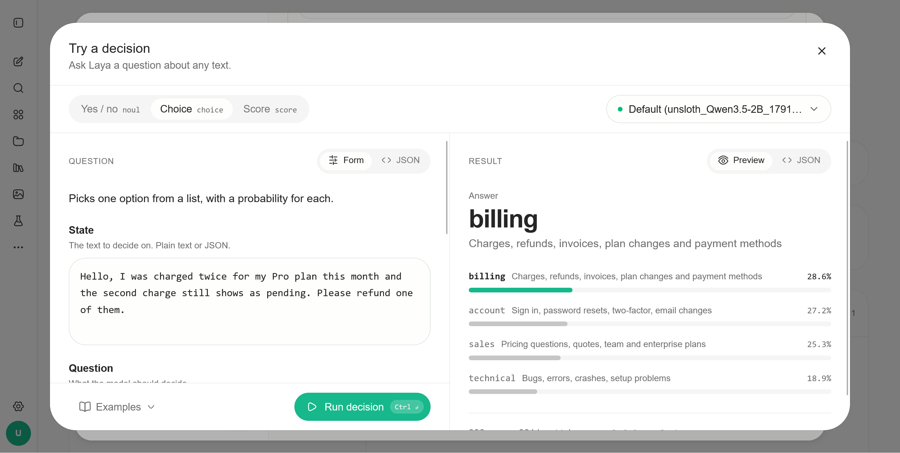

# 用 Unsloth 训练你自己的决策模型（Train your own Decision Model with Unsloth）

> 原文：[Train your own Decision Model with Unsloth](https://unsloth.ai/docs/basics/train-your-own-decision-model-with-unsloth) · Unsloth 官方文档 · unsloth.ai · 快照 2026-10-08
>
> 译文为社区学习用途的非官方中文翻译，版权归原作者所有。

---

## 作者与来源

**Unsloth（unsloth.ai，UnslothAI）**是最知名的开源大模型微调库之一：以自研 Triton 内核把 LoRA/QLoRA 微调做到显著更快、更省显存著称，覆盖 Qwen、Gemma、Llama 等主流开源模型，提供桌面App、命令行与 Python API 三种用法。

本页是其官方文档的一篇教程，宣布微调库**一等支持「决策模型」训练**：新增 `FastDecisionModel` / `DecisionTrainer` API，给语言模型接一个与 **Clef 同设计**的打分头，把 Qwen、Gemma 这类 LLM 变成「只做判断、不生成文本」的决策模型；数据格式与 **Laya、Clef 通用**，训练完可以直接挂进本地的 Decision API，**顶替 `laya` / `jev-latest` 端点对外服务**。

**与本库其他条目的关系**：这等于把本库 **25 号**（MacBook 上 RL 训 Gero-4B）和 **27 号**（免训练读 logits）两条自制路线做了「工业化合流」——免训练路线保底、LoRA 微调可达 78%，而且 4GB 显存、42 分钟就能出结果；**10 号**（laya-model）训的模型本身还能继续微调（表中 Laya fine-tuned：2.5GB、10 分钟、77%）。

---

## 正文

微调 Qwen、Gemma 这类 LLM，让它们以**带校准的概率**做决策。

你现在可以用 Unsloth 训练自己的决策模型——就像 **Jev**、**Laya** 和 **Clef** 那样。微调 [Qwen3.8](https://unsloth.ai/docs/models/qwen3.8) 和 [Gemma 4](https://unsloth.ai/docs/models/gemma-4) 等 LLM，把它们变成决策模型：**做决策**而不是生成文本。微调后的模型读取你的输入，给你提供的选项打分，返回一个带概率的选择。训练后的基准成绩见下表：

| 模型 | typed-decisions | BANKING77 | CLINC150 | 留出集准确率 |
| ------------ | --------------- | ----------- | ----------- | ------- |
| Qwen3.5-0.8B | 36% → **73%** | 7% → **74%** | 19% → **76%** | 78% |
| Qwen3.5-2B | 33% → **78%** | 1% → 58% | 1% → 62% | 81% |

我们用 **LoRA（r=64）只训了一个 epoch**、给 LLM 接上 Clef 式的打分头，就把下游准确率从 30–37%（大致等于瞎猜）拉到了**最高 78%**。

训练使用与 Laya 和 Clef 相同的数据集格式。测试集对训练数据做了**去污染**（decontamination）处理。

> 演示视频：[github.com/user-attachments/assets/92959172-d2a2-450b-a5bf-6369a1e5ae16](https://github.com/user-attachments/assets/92959172-d2a2-450b-a5bf-6369a1e5ae16)

**所有模型**都可以这么做——你还可以对 Laya / Clef 这类现成决策模型**继续微调**。

| 模型 | 测试准确率 | 显存 | 训练时长 |
| ------------- | ------ | ------ | ------ |
| Qwen3.5-0.8B | 78% | 4GB | 42 分钟 |
| Qwen3.5-2B | 81% | 8GB | 40 分钟 |
| Llama 3.2 3B | 79% | 4.1GB | 30 分钟 |
| Gemma 4 E4B | 77% | 14.4GB | 49 分钟 |
| Laya（继续微调） | 77% | 2.5GB | 10 分钟 |

数据集混合了 **12 个来源**外加 `typed-decisions`：`ag_news`、`arc`、`banking77`、`boolq`、`clinc150`、`commonsense_qa`、`mmlu`、`mnli`、`prompt_injections`、`snli`、`sst5` 和 `wanli`。**测试集共 3,000 行**：2,000 行来自 typed-decisions，500 行来自 BANKING77，500 行来自 CLINC150。

### 🦥 在 Unsloth（桌面版）里训练

**第一步：安装 Unsloth。** 最简单的方式是下载 [Unsloth 桌面应用](https://unsloth.ai/download)，支持 macOS、Windows 和 Linux。也可以手动安装——macOS/Linux/WSL：`curl -fsSL https://unsloth.ai/install.sh | sh`；Windows PowerShell：`irm https://unsloth.ai/install.ps1 | iex`。

**第二步：选模型和数据集。** 打开 Train 标签页，选一个 LLM（比如 `unsloth/Qwen3.5-4B`），然后把 **Train as** 设为 **Decision model**。Unsloth 会自动填好合适的设置。想复现我们的结果：epochs 设 2、LoRA rank 设 16、学习率设 2e-4。上传文件或从 Hugging Face 选一个数据集（按数据集格式），typed-decisions 要把 **Subset** 设为 `all`。


**第三步：开始训练。** 点击 **Start Training**。Unsloth 会报告训练前后在留出决策上的准确率，并对模型的置信度做校准。



**第四步：在 Decision API 里使用。** 点击 **Use in Decision API**。之后使用 `laya`、`default` 或 `jev-latest` 的请求都会路由到你的模型。


你的模型还会以运行名出现在 Settings → API 的 Decision API → Model 下拉里。


**第五步：试玩。** 在 Decision API 的 "Try It" 里直接跟训练好的决策模型交互：




### 🐍 用代码训练

`pip install --upgrade unsloth` 安装或更新后，用下面的代码训练你自己的决策模型：

```python
from unsloth import FastDecisionModel, DecisionTrainer, is_bfloat16_supported
from datasets import load_dataset
from transformers import TrainingArguments

model, tokenizer = FastDecisionModel.from_pretrained(
    model_name = "unsloth/Qwen3.5-4B",
    max_seq_length = 2048,
    load_in_4bit = True,
)

model = FastDecisionModel.get_peft_model(
    model,
    r = 16,
    lora_alpha = 16,
    lora_dropout = 0,
    use_gradient_checkpointing = "unsloth",
    random_state = 3407,
)

dataset = load_dataset("LocalLLaMA/typed-decisions", "all", split = "train")
items, report = FastDecisionModel.build_dataset(dataset, tokenizer, model)
print(f"Skipped {report['skipped']} of {report['total']} decisions")

train_items, eval_items = FastDecisionModel.split_holdout(items, seed = 3407)

trainer = DecisionTrainer(
    model = model,
    processing_class = tokenizer,
    train_dataset = train_items,
    eval_dataset = eval_items,
    args = TrainingArguments(
        per_device_train_batch_size = 8,
        gradient_accumulation_steps = 4,
        num_train_epochs = 2,
        learning_rate = 2e-4,
        lr_scheduler_type = "cosine",
        warmup_steps = 10,
        weight_decay = 0.01,
        bf16 = is_bfloat16_supported(),
        fp16 = not is_bfloat16_supported(),
        eval_strategy = "epoch",
        logging_steps = 10,
        output_dir = "outputs",
        report_to = "none",
        seed = 3407,
    ),
)
trainer.train()
```

要用 Llama 或 Gemma 4，把 `model_name` 改成 `unsloth/Llama-3.2-3B-Instruct` 或 `unsloth/gemma-4-E4B-it`。其他 Unsloth 能微调的 LLM 应该同样可行。

用你自己的数据时，参考数据集格式：每行包含一个状态（state）、要判断的问题和金标答案。

#### 校准与保存

在 `split_holdout` 留出的那些数据上做校准，让模型的概率与它的实际正确率对齐：

```python
metrics = FastDecisionModel.calibrate(model, tokenizer, eval_items)
print(metrics) # 留出集准确率、校准误差（ECE）和损失
```

然后保存。`save_pretrained` 保存 LoRA 适配器和打分头；`save_pretrained_merged` 保存完整的 16-bit 模型：

```python
model.save_pretrained("qwen-decisions")
model.save_pretrained_merged("qwen-decisions-merged")
# model.push_to_hub("hf_username/qwen-decisions", token = "hf_...")
```

重新加载的方式与加载基座模型相同：

```python
model, tokenizer = FastDecisionModel.from_pretrained("qwen-decisions", load_in_4bit = True)
```

### 🎯 做决策

给 `predict` 传一个输入和要判断的问题，格式与数据集一致：

```python
FastDecisionModel.for_inference(model)
answers = FastDecisionModel.predict(
    model,
    tokenizer,
    "Hi, I was charged twice for invoice #4411. Please refund the duplicate today.",
    {
        "team": {
            "type": "choice",
            "instructions": "Which team should handle this?",
            "criteria": {
                "billing": "invoices, payments, refunds",
                "technical": "bugs, outages, errors",
                "sales": "pricing, new plans",
            },
        },
        "refund": {"type": "noul", "instructions": "Does the customer ask for a refund?"},
    },
)
print(answers["team"]["answer"])        # "billing"
print(answers["team"]["probabilities"]) # {"billing": ..., "sales": ..., "technical": ...}
```

`answer` 在 choice 里是选项键名，noul 里是 `True`/`False`，score 里是档位数字。每个答案还带有与 Decision API 答案相同的字段。

要在有标注的测试集上查准确率，用 `evaluate`：

```python
test = load_dataset("LocalLLaMA/typed-decisions", "all", split = "test")
test_items, _ = FastDecisionModel.build_dataset(test, tokenizer, model)
print(FastDecisionModel.evaluate(model, tokenizer, test_items))
```

### 接入 Decision API

详细的服务指南见 [decision-laya 文档](https://unsloth.ai/docs/models/decision-laya)。在 Unsloth 里训练的模型会出现在 Settings → API。用代码训练的模型，启动 Unsloth 时指向保存的合并目录：

```bash
UNSLOTH_SYSTEMONE_MODEL=/path/to/qwen-decisions-merged unsloth studio -H 0.0.0.0 -p 8888
```

在 Settings → API 里打开 Decision API 后，使用 `laya`、`default` 或 `jev-latest` 的请求都会走你的模型，答案格式与 Laya 一致。模型需要 GPU，首次请求时加载（可能需要几分钟）。训练任务占用 GPU 时，Decision API 会等待，训练结束后恢复应答。

### 工作原理

Unsloth 把你的输入放进一个 prompt，后面跟上每个问题及其选项。LLM 只读一遍。一个小型打分头——与 Cloudflare 的 Clef 同设计——查看 LLM 输出中每个问题、每个选项对应的部分，给每个选项打分，**一次把所有问题一起判完**。它从不写文本，所以不用在 LLM 的词预测上花显存。

### ⚙️ 推荐设置

- 从 4-bit LoRA、rank 16、学习率 2e-4 起步。新打分头默认用 1e-4，可在 `DecisionTrainer` 里用 `head_learning_rate` 修改。
- typed-decisions 上我们用了 2 个 epoch。数据更少时试 3 或 4。
- 快速试跑可设 `max_steps = 60`：Qwen3.5-4B 在 L4 上 10 分钟到了 76%。
- 显存不够时，批量减半、梯度累积翻倍。
- `max_seq_length` 决定训练时的最长输入。输入过长时保留问题与选项、截断输入末尾来适配。推理最多读 16,384 token。

---

## 译注

- **成绩口径**：两张表的数字均为 Unsloth 自报（厂商口径）。文档声明测试集做了去污染、且含 2,000 行留出数据，口径比一般「在训练集上自测」的自报更严，但仍无第三方复测——按本库 **30 号**的方法论，引用前建议自己跑一遍 `evaluate`（代码文中已给出）。
- **「Clef 式打分头」**：即在 LLM 之上加一个小型分类头，直接对「问题×选项」输出概率，不再走词表——这与本库 **32 号**（omarsar 教程引用的 Clef 架构）和 **27 号**（免训练直接读 logits）是同一思路的两种实现：27 号不改模型权重，这里要训 LoRA + 打分头。
- **`typed-decisions` 数据集**在 Hugging Face 的 `LocalLLaMA/typed-decisions`，格式为「状态 + 问题（choice/noul/score 三型）+ 金标」，与 Laya/Clef 的训练格式通用。
- **原文的小不一致照实保留**：导语写 "Qwen3.8"，表格与代码用的是 Qwen3.5 系列——以代码为准。
- 页面末尾附有一段 GitBook 平台给 AI 智能体的检索说明（Agent Instructions），与教程内容无关，未收录。
- **与本库训练路线的对照**：本库演讲材料的四路线里，这属于路线 B（监督微调版）——比 25 号的 RL 路线简单（有标注就能训，不需要奖励设计），比 27 号的免训练路线多一步训练但准确率高得多（73–81% 对约 60% 档）；「Laya 继续微调 10 分钟到 77%」提示现成决策模型做领域适配的成本已经很低。
