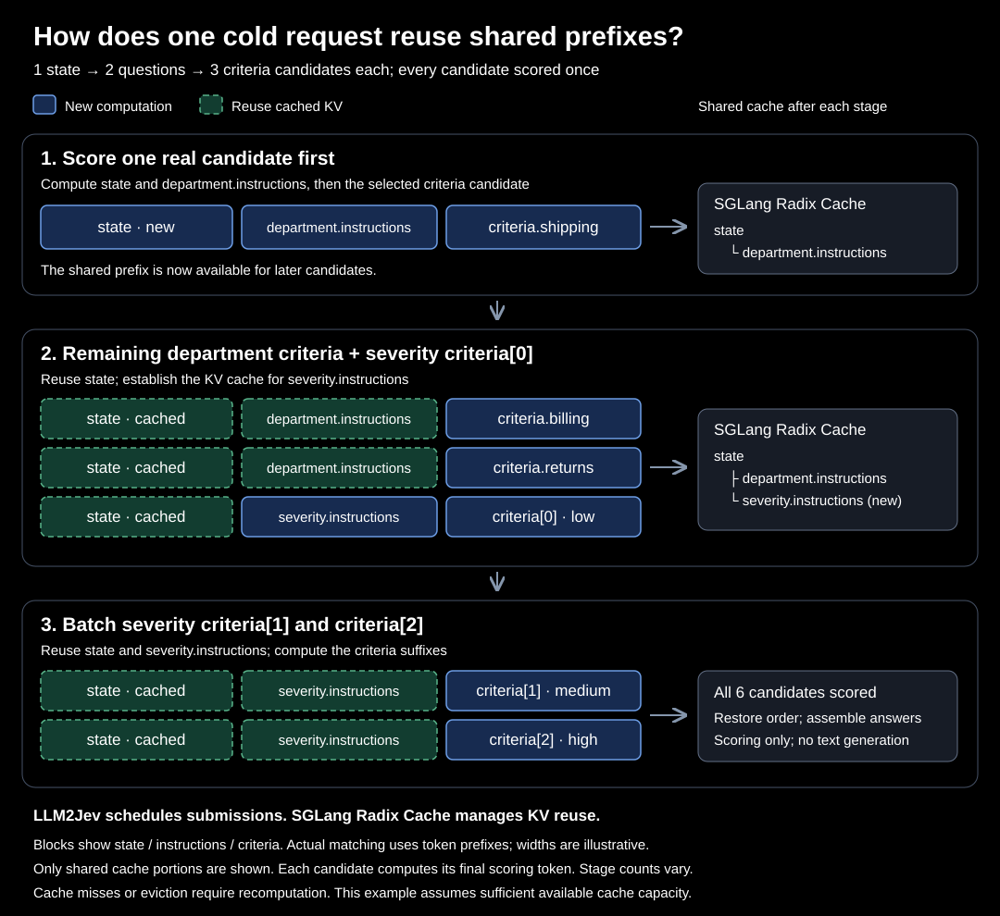
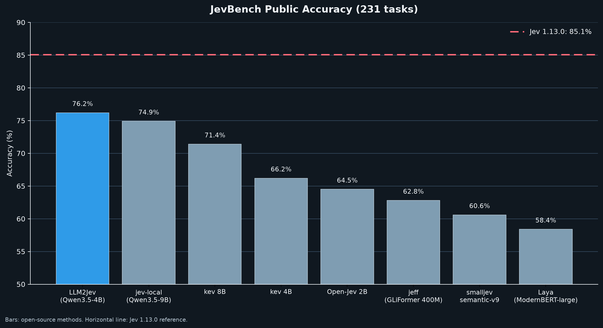

# LLM2Jev 代码仓库：把本地 LLM 变成 Jev 式决策模型（项目介绍）

> 原文：[GitHub Yinsongxu/LLM2Jev](https://github.com/Yinsongxu/LLM2Jev) · 项目 README 整理编译 · 快照 2026-10-09
>
> README 附有作者提供的[官方中文版](https://github.com/Yinsongxu/LLM2Jev/blob/main/README_zh.md)；本文为知识库视角的整理介绍，非逐句翻译，版权归原作者所有。


---

## 项目与作者

**LLM2Jev**（GitHub [Yinsongxu/LLM2Jev](https://github.com/Yinsongxu/LLM2Jev)）：把本地语言模型变成 Jev 式结构化决策模型的开源实现——**只用预填充（prefill）从 logits 里取结果，不做逐 token 解码**。仓库 2026-09-19 创建，Python 3.12+，Apache-2.0 许可，快照时 413 star / 45 fork。官方声明：**独立开源项目，与 Jev / TypeSafe 无隶属或背书关系**；推理接口与官方 `POST /v1/systemone` 兼容。

与 **35 号条目**（arXiv 2610.02076 论文《LLM2Jev》）的关系：方法同源——括号数字候选、`Best answer: [` 预填充、后缀并行打分，基准口径兼容（同为 JevBench 231 公开题 + Qwen3.5-4B）。README 未直接引用论文、论文也未挂仓库链接，作者身份无官方声明；可视为**同一方法的工程实现与学术论证互为印证**。

## 核心特性

- **后端广**：SGLang（NVIDIA GPU）、Transformers、MLX（Apple Silicon）三后端，Python API 与 HTTP 服务两种用法，共享同一套打分接口。
- **只预填充、不解码**：概率直接在 prefill 阶段从 logits 组装——这是延迟优势的来源。
- **多模态输入**：`state` 与 `instructions` 可混排文本与图像（SGLang / Transformers / MLX-VLM），论文中的零样本视觉决策在这里开箱可用。
- **冷请求前缀复用**：候选共享 `state`、同题候选共享 `instructions`。SGLang 后端先对一条真实 `criteria` 候选打分以建立 Radix Cache 前缀，再提交能复用它的候选；每条候选只打一次分，长输入多候选时省大量重复计算。MLX 后端则显式预填充共享前缀再打候选后缀。



## 快速开始

```bash
git clone https://github.com/Yinsongxu/LLM2Jev.git
cd LLM2Jev
uv sync --extra sglang
source .venv/bin/activate
python examples/sglang_inference.py --model-path /path/to/model
```

示例提交 Choice / Score / Noul 三种问题并以 JSON 打印响应；模型路径换成任意 Hugging Face 兼容的因果语言模型目录即可。图像服务见仓库 [multimodal 文档](https://github.com/Yinsongxu/LLM2Jev/blob/main/docs/multimodal.md)。

## 性能：JevBench 公开 231 题对比（仓库自报）

| 系统 | 准确率 | 延迟 P50 (s) | 延迟 P95 (s) |
|---|---:|---:|---:|
| Jev 1.13.0（TypeSafe AI） | 85.1% | 0.652 | 0.722 |
| **LLM2Jev（Qwen3.5-4B）** | **76.2%** | **0.048** | **0.346** |
| jev-local（Qwen3.5-9B） | 74.9% | – | – |
| kev 8B（research preview） | 71.4% | – | – |
| kev 4B（research preview） | 66.2% | – | – |
| Open-Jev 2B（Zefan Cai） | 64.5% | – | – |
| jeff（GLiFormer 400M） | 62.8% | – | – |
| smalljev semantic-v9 | 60.6% | – | – |
| Laya（Convai Innovations，ModernBERT-large 421M） | 58.4% | – | – |



**卖点是延迟**：P50 48ms 对 Jev 官方 652ms——**不到十分之一**；准确率 76.2% 落后 Jev 的 85.1% 约 9 分。评测协议：jevbench CLI + TypeSafe 适配器打本地端点；Jev 侧延迟取 JevBench 官方串行实测，LLM2Jev 侧为本地端点实测（复现命令见仓库 [jevbench.md](https://github.com/Yinsongxu/LLM2Jev/blob/main/docs/jevbench.md)）。

另有 **Valen-Eval-Game**：基于 [Valen](https://github.com/Liuziyu77/Valen) 的 500 道图像条件推箱子单步评测（tie-aware 最优动作准确率），走多模态 Choice 管线。

## 演示

- [Web 演示](https://github.com/Yinsongxu/LLM2Jev/blob/main/demos/web/README.md)：交互式提交混合类型问题、查看各选项概率
- [贪吃蛇](https://github.com/Yinsongxu/LLM2Jev/blob/main/demos/snake.py)：模型驱动决策
- [MuJoCo 抓取放置](https://github.com/Yinsongxu/LLM2Jev/blob/main/demos/pick_place/README.md)：机器人操作单步决策
- [Valen 推箱子](https://github.com/Yinsongxu/LLM2Jev/blob/main/examples/valen_sokoban.py)：视觉 Sokoban（2026-10-08 新增）

## 版本时间线（News 节选）

| 日期 | 更新 |
|---|---|
| 09-20 | SGLang 打分后端 + 兼容 `POST /v1/systemone` 端点 |
| 09-21 | 冷请求前缀复用（Radix Cache 分批提交）+ Web/贪吃蛇演示 |
| 09-22 | 多模态输入（SGLang / Transformers / System One HTTP） |
| 09-23 | MLX 后端（Apple Silicon 文本与图像打分、候选批处理） |
| 09-26 | JevBench 评测发布 |
| 10-08 | Valen Sokoban 视觉演示与单步动作评测 |

## 路线图与许可

- [ ] 覆盖更多模型规模/数据集/负载的基准（决策质量、延迟、吞吐）
- [x] 交互式 Web 演示；[x] Transformers 与 SGLang 的本地图像支持；[x] 更多多模态任务与演示

Apache License 2.0；测试：`python -m unittest discover -s tests -v`。

---

## 译注

- **76.2% 与 35 号论文数字的关系**：论文报告 Qwen3.5-4B 免训练 81.4%、全参微调 80.5%、LoRA+强锚定 84.0%（同为 231 公开题，但用论文自己的评测 harness）。仓库 jevbench.md 自报 76.2%，用的是 jevbench CLI + TypeSafe 适配器打 HTTP 端点——**harness 与协议不同、checkpoint 未注明**，两组数字不可直接互比，引用时注意口径。与 15 号 JevBench 官方榜单同理。
- **延迟对比的前提**：48ms 是本地端点（GPU 在手、无网络与排队），652ms 是 JevBench 官方对商用 API 的串行实测——本地自托管与云端 API 的对比，部署成本（GPU）不计入延迟账，与 **33 号**（Arena 对 Jev Router 的实测）的"成本要算全"精神一致。
- **表里的 Laya**（Convai Innovations，ModernBERT-large 421M）与本库 **10 号** laya-model（语言模型底座的决策模型）**不是同一类东西**——这是一个 421M 参数的 BERT 型编码器方案，恰是论文 §2 说的"孤立打分/专用小模型"路线的样本。
- 表中 kev / smalljev / jeff / Open-Jev 等社区模型与 **15 号**（JevBench 生态）、**35 号附录 I** 的盘点同源，可作为社区模型全景的第三处交叉参照。
