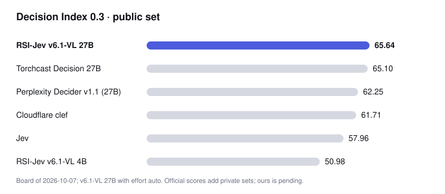

# RSI-Jev：递归自我改进环路造出的决策模型（项目介绍与原理）

> 原文：[GitHub Shanghua-Gao/RSI-Jev](https://github.com/Shanghua-Gao/RSI-Jev) · 项目 README 整理编译（含原理） · Shanghua Gao · 快照 2026-10-09
>
> 本文为知识库视角的整理介绍，版权归原作者所有；代码 MIT、权重 Apache-2.0。



---

## 作者与来源

**Shanghua Gao（高尚华）**，哈佛大学 Research Fellow，与 Marinka Zitnik 教授合作；南开大学博士（师从程明明）。研究方向为基础 AI 模型（表示学习、生成建模、高效架构）与 AI for Science——尤其是面向生物医学推理与科学发现的自主智能体系统。RSI-Jev 自述是 **AutoScientists**（mims-harvard）的下一代版本：把「智能体自主做科研」的方法论对准了决策模型训练。仓库 2026-09-22 创建，98 star，代码 MIT、权重 Apache-2.0，**与 TypeSafe 无隶属关系**；致谢 HP/NVIDIA 提供 GB10 硬件。

**证据分级提示**：本项目所有成绩为作者自报——但与一般自报不同，它把 **496 个实验（含全部失败）逐个发布**（EXPLORE.md）、每个版本的训练记录与局限公开（versions/）、权重可下载复核，属于「可复算的从业者自报」，证据强度显著高于厂商口径。

## 它造的是什么

回答是非题（noul）、K 选一（choice）、量表打分（score）的 Jev 式决策模型：对文档、对话或图像做**一次前向**，返回每个选项的校准概率，不生成任何文本。服务端说 **Jev 的 API**（`POST /v1/systemone`，模型名 `jev-latest`），现有 Jev 客户端改个 base URL 就能用；每个响应还会报告**是哪一层回答的、置信多少**。

```bash
pip install "rsi-jev[fast,vision] @ git+https://github.com/Shanghua-Gao/RSI-Jev"
rsi-jev serve v6.1-vl-4b --effort auto --port 8000   # 96GB GPU 可直接 serve 27B
```

## 原理一：递归自我改进环路（RSI Loop）

这是项目的核心方法论。**AI 智能体提出假设 → 在花 GPU 之前先登记预测 → 跑实验 → 证据说话时亲手退役自己的冠军模型**。每个版本、以及路上每一个失败的实验，都连同数字一起发布：

- **13 天 8 个版本**（v1.0 → v6.1-VL），每个都由环路训练、评估、写文档；
- **496 个实验**逐个记录（[EXPLORE.md](https://github.com/Shanghua-Gao/RSI-Jev/blob/main/EXPLORE.md)），失败原因全写明；
- 用户的「模型自信地答错了」报告会变成下个版本里被检验的登记预测。


## 原理二：多层答案头与 effort 分档

v6.1-VL 不是只在最后一层读答案——它在多个中间层都挂了答案头，`effort` 参数决定一次请求用到多深：

| effort | 4B 用层 | 中位延迟 | 适用 |
|---|---|---|---|
| `low` | 16 | 23 ms | 意图、路由、检索——第 16 层已不输第 32 层 |
| `medium` | 20 | 27 ms | 分类与判断 |
| `high` | 32 | 40 ms | 知识、多步推理、代码 |
| `auto` | 16/20/32 | 28 ms | 混合流量：**在第一层「足够自信」处停** |

27B 同构（Qwen3.8-27B 的第 48/56/64 层）。配套工程细节：每个出口有独立温度校准；出口头读取所在层的 **detached 副本**（梯度不回传主干，防止出口训练破坏深层能力）；`auto` 的出口策略要在**留出的测试分布代理**上调——在训练分布上调好的策略遇到难题会过早退出。文档称「简单任务快、困难任务深」。

## 原理三：496 个实验换来的训练原则

README 里最值钱的是这张「哪些实验让版本晋升、哪些被拒」的完整清单，可提炼为几条可迁移的原则：

1. **在基准自己的训练集上微调被拒绝**——typed-decisions +0.12 但损伤通用知识；补 15% 通用知识回放才把代价还回来（第一个晋升的实验）。通用知识回放是「蹭基准分」的解毒剂。
2. **「冻结」不如「慢学习率」**：微调损伤 MMLU-Pro 时，冻结底部 1/3 层能部分恢复但弄坏三个决策基准（它们需要适配）；把底部 8 层学习率降到 1/10 则两头兼顾——「从来不是数据问题，是整塔单速率微调把知识所在的层覆盖了」。
3. **第一个有效的 RL 阶段是列表级重排奖励**：对 16 个候选项算 NDCG@5 的排序奖励、配 KL 锚定，重排 R@1 提升 60%——「候选*顺序*里携带的信息是逐条标注给不了的」。另一个 RL 阶段让「自信的错误」付出 4 倍于「胆小的正确」的代价，准确率与校准同时改善。
4. **视觉走基座冻结的视觉塔**，文本水平不掉；但图像训练会让模型丢掉「unknown」答案——**想让它会说不知道，数据里就得有该说不知道的题**（KoBBQ 歧义题 0.679 → 0.891）。
5. **读出细节是隐藏的大分**：某外部基准发现的读出 bug——每个选项要池化**它自己的** token 而不是前一选项后的分隔符——同一份权重修好后 CLINC150 从 0.383 → 0.753。
6. **短而干净胜过长而脏**：干净语料 1 万步胜过旧语料 4 万步（留出集 +0.026）；在分布内调好的策略会过早停。
7. **同底座双微调的权重平均（0.5/0.5）胜过两个母模型**——4B 与 27B 上都成立，收益在塔里、头不贡献。
8. 短输入右填充到 64 token 倍数后走 CUDA graph，单条短请求延迟约减半（27B 逐请求时瓶颈在 kernel 启动而非算力）。

## 战绩：8 个版本

| 模型 | 输入 | Decision Index 0.3 | 0.2.1 | 留出集 |
|---|---|---|---|---|
| **v6.1-VL-27B**（auto） | 文+图 | **65.64** | 64.92 | 0.808 |
| v6.1-VL-4B | 文+图 | 50.98 | 50.74 | 0.729 |
| v6.0-VL-4B | 文+图 | 46.23 | 46.24 | 0.698 |
| v5.0-VL-3B | 文+图 | – | 38.38 | 0.689 |
| v4.0-VL-2B | 文+图 | – | – | 0.653 |
| v3.0-2B / v2.x / v1.x | 文 | – | – | 0.604–0.649 |

4B 及以下从 Qwen3.5-Base 微调；v6.1-VL-27B 从 Qwen3.8-27B 微调。留出集是零样本检查，任何版本都没在上面训过。官方评分 pending（v6.1-VL 27B 的 65.64 为作者按公开集自测）。

## 版本时间线

| 日期 | 版本 | 一步 |
|---|---|---|
| 09-28 | v3.0 | 第一个 RL 真正起作用的版本（重排奖励） |
| 10-01 | v4.0-VL | 读图，文本保持 v3.0 水平 |
| 10-02 | v5.0-VL 3B | 截取前 20/32 层；学会说「unknown」 |
| 10-06 | v6.0-VL 4B | 按题自选深度（16/20/32 层谁先自信谁答） |
| 10-07 | v6.1-VL 4B | v6.0-VL 与同底座第二次微调做权重平均：46.23 → 50.98 |
| 10-08 | v6.1-VL 27B | 同方法上 27B：Decision Index 0.3 公开集 65.64 |

---

## 译注

- **65.64 的口径**：Decision Index **0.3 公开集**（即本库 **23 号** Cloudflare 引入的那套公开评测的新版本），自测、官方评分 pending；同板 Clef 61.71、Jev 57.96。这与 **15 号** JevBench 是**两套不同基准**，数字不可互比；「超越 Jev」目前是作者口径——但考虑到 496 个实验与权重全公开，这是社区「反超 Jev」叙事里**可复算程度最高的一例**（对照 **33 号** Arena 的实测精神）。
- **与训练路线条目的对照**：RSI-Jev 是**全参微调 + 多层答案头 + RL 阶段**的完整研究管线，比 **34 号**（Unsloth：LoRA + 外接打分头，40 分钟出活）重得多；与 **35 号**（LLM2Jev：架构保持、免训练优先）哲学相反——RSI-Jev 改架构（多层出口头）、依赖大规模迭代训练。三者合看：决策模型的「够用线」可以很低（免训练 81.4%），但「上限线」的争夺已经卷到多层出口、权重平均与 RL 重排这种细节上。
- **多层出口头的价值排序**是个好例子：对多数任务第 16/48 层就够（`low` 与 `high` 质量几乎同分），延迟差近一倍——这与 **35 号**论文「强模型主要需要语法对齐、不需要深层参数位移」的发现互相印证：决策能力在Transformer 的中浅层就已成形。
- **RSI 环路本身**可能是比模型更大的贡献：它把「预测先登记、失败也发布」的预注册文化搬到了模型训练上——本库 **30 号**（独立实测方法论）与 **33 号**（Arena 独立评测）代表「验证侧」的严谨，这个项目代表「生产侧」的严谨。
