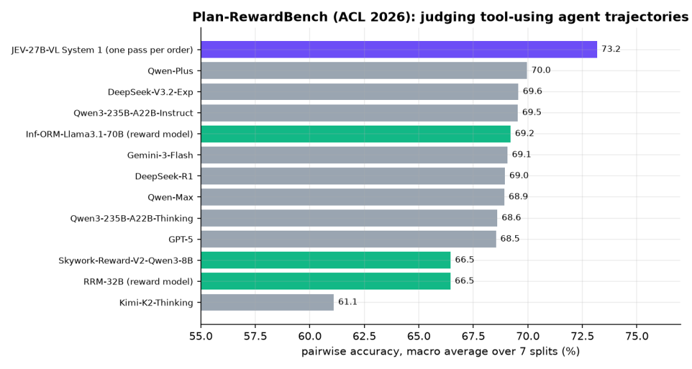
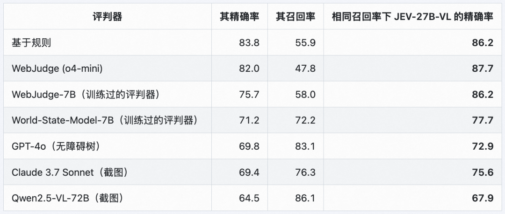
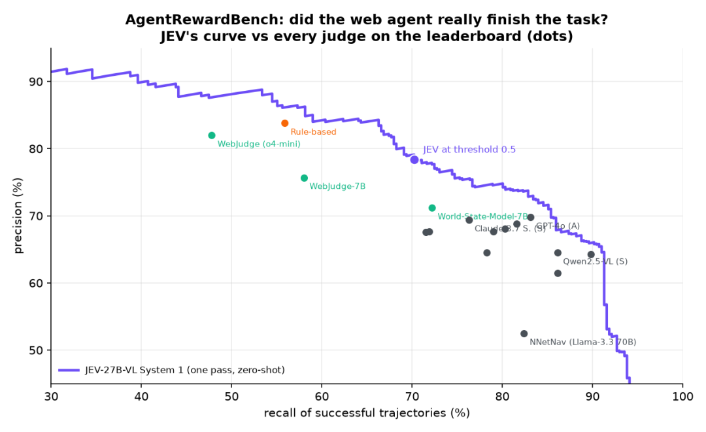
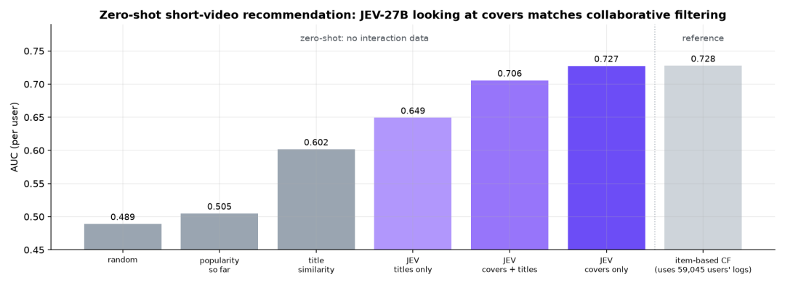
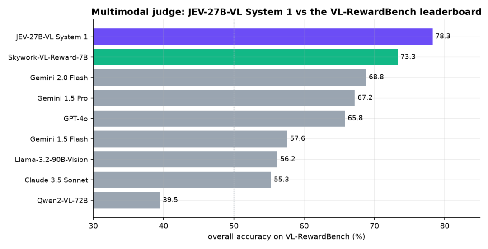
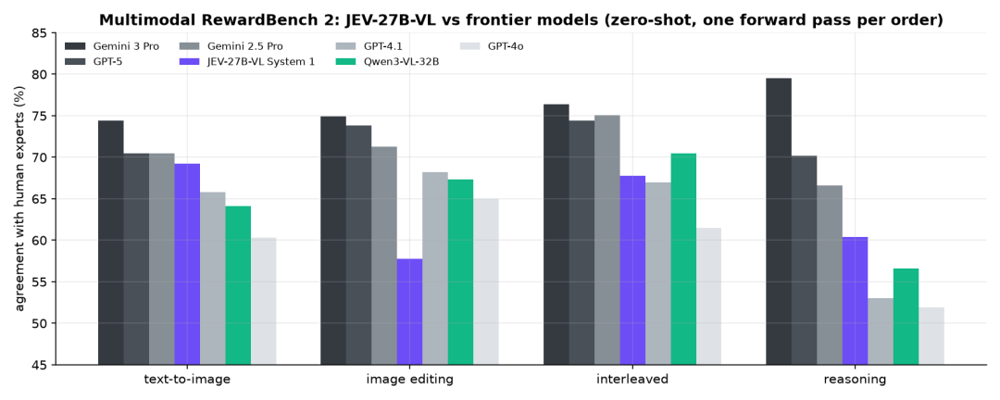

# JEV-27B-VL 开源：多模态决策模型——模型结构与跑分整理

> 原文：[JEV-27B-VL 开源：多模态决策模型，Jev Decision Index 0.3 视觉榜单第一](https://mp.weixin.qq.com/s/gmlnplgfMg_x0_C0UbPCmg) · 微信公众号「魔搭ModelScope社区」 · AutoTrust AI Lab 模型发布文 · 2026-10-09
>
> 原文为中文发布文，本页为知识库视角的整理收录（结构与跑分单列成表），版权归原作者所有。

---

## 作者与来源

**AutoTrust AI Lab** 开源 **JEV-27B-VL**：基于 Qwen3.8-27B 的多模态决策模型，可以视为「能看见的 JEV-27B」——沿用 System 1 决策与 System 2 推理的双通道设计，把决策能力扩展到图像输入。发布文由魔搭 ModelScope 社区公众号推送（与本库 **19 号**同账号）。模型 Apache 2.0 开源，地址：[modelscope.cn/models/autotrust/JEV-27B-VL](https://modelscope.cn/models/autotrust/JEV-27B-VL)。

一句话定位：**截至 2026-10-07，Jev Decision Index 0.3 视觉榜单 20 个视觉决策模型中排名第一**（13,695 条评测数据 77.8% 准确率），且在同一基准的全量榜（FULL SCORE 69.8）位居总榜第一。


## 模型结构

**双通道设计**，一个模型、两个接口：

- **System 1（决策通道）**：单次前向传播完成 yes/no 判断（noul）、**2–256 个选项选择**（choice）、0–5 评分（score），输出**校准概率**。实现为 vLLM 上的 **LoRA 决策头**（启动参数 `--enable-lora --lora-modules jev-decision=adapter_vllm --max-lora-rank 32 --logprobs-mode processed_logprobs`），走专用接口 `POST /v1/decide`，请求含 `kind`、`state`、`question`、可选 `options`，返回每个选项的概率、最高概率选项、token 用量与耗时（示例请求返回 billing 约 0.9969）。
- **System 2（推理通道）**：保留 Qwen3.8-27B 的通用多模态理解与推理能力，走标准 OpenAI 兼容 `/v1/chat/completions`，可关闭思考模式直接回答图像问题。

**最关键的结构性质：决策头仅通过纯文本训练，即可零样本迁移至图像**——图像决策时把 `state` 写成文本与图片交替组成的列表（HTTPS URL 或 Base64 data URL 均可），单图请求最多 8 张图。

**部署与上下文**：默认 32K 上下文、建议 80GB 显存 GPU；完整 256K 上下文需额外 KV Cache（官方在 183GB B200 上测试，80GB 卡建议上限设 131072）。启动脚本 `serve.sh` 在 8000 端口同时提供 vLLM OpenAI 服务与 `/v1/decide`；其余启动参数含 `--enable-prefix-caching`、`--mamba-cache-mode align`、`--max-num-seqs 8`、`--trust-request-chat-template`。

## 跑分整理

### 榜单

| 基准 | 成绩 | 说明 |
|---|---|---|
| **Jev Decision Index 0.3 视觉榜** | **第 1 / 20** | 13,695 条评测数据，准确率 **77.8%**（截至 2026-10-07） |
| **Decision Index 0.3 全量榜（FULL SCORE）** | **69.8，总榜第一** | 见上图；同板 RSI-Jev v1.1 (27B) 67.7、Clef 61.71、Jev 57.96（37 号条目口径的 65.64 为其公开集分，全量/公开集口径不同） |

### 智能体与机器人

| 基准/场景 | 成绩 | 细节 |
|---|---|---|
| 机械臂抓取放置 | **75%**（20 随机场景，JEV 系列最佳） | 每步都是一次 System 1 决策（左/右、上/下）；成功方块 15/15 入托盘，失败均为偏离目标 3.0–3.7 cm；每次决策约 **240 ms** |
| Plan-RewardBench（ACL 2026） | **73.2%** 宏平均（1,171 对） | 从两条工具型智能体轨迹中选更优者；超过 Qwen-Plus 70.0、DeepSeek-V3.2-Exp 69.6、GPT-5 68.5、Kimi-K2-Thinking 61.1 等 |
| AgentRewardBench | 精确率 **78.4%** / 召回率 70.2% / AUROC **0.91**（阈值 0.5） | 1,302 条专家标注轨迹，零样本判断网页智能体是否真完成任务；**在每个判官自身召回率水平下精确率高于官方排行榜所有判官**（含规则法、WebJudge o4-mini、GPT-4o、Claude 3.7 Sonnet、Qwen2.5-VL-72B）；全部判断单卡 GPU 约 4 分钟 |
| 计算机操作（浏览器） | **95%**（商店/设置/邮件 60 个多步任务） | 结合编号框与元素文本；每任务 3–7 次点击，每次点击决策约 0.26 s；纯颜色样本完全由截图决定 |







### 推荐与视觉任务

| 基准/场景 | 成绩 | 细节 |
|---|---|---|
| 零样本短视频推荐（MicroLens-100k，200 用户） | **0.727 AUC**，Top-5 命中率 59% | 仅看最近 5 条 + 1 条候选的视频封面，一次前向返回观看概率；与用 59,045 名用户行为训练的物品协同过滤（0.728 / 49%）基本持平甚至命中率更高；对照：随机 0.489、热门 0.505、标题相似 0.602、仅标题 0.649、封面+标题 0.706 |
| Quick, Draw! 草图识别（320 幅真实玩家草图） | 完整绘制 **88%**；仅 60% 笔画 **62%**（随机 6%） | 按绘制过程逐笔判断 16 类；每次判断约 270 ms |
| VL-RewardBench（CVPR 2025） | **78.3%**（1,247 对人工核验） | 零样本判断哪个候选答案更好，超过官方排行榜所有模型：Skywork-VL-Reward-7B 73.3、Gemini 2.0 Flash 68.8、GPT-4o 65.8、Claude 3.5 Sonnet 55.3、Qwen2VL-72B 39.5 |
| Multimodal RewardBench 2（4×1,000 对专家标注） | 四任务平均与 **GPT-4.1、Qwen3-VL-32B 相当** | 任务：文生图 / 图像编辑 / 交错输入 / 推理得分；GPT-5 与 Gemini 3 Pro 仍保持领先 |







## 使用与下载

```bash
pip install -U modelscope
modelscope download --model autotrust/JEV-27B-VL --local_dir JEV-27B-VL
bash JEV-27B-VL/serve.sh        # 8000 端口：vLLM OpenAI 服务 + POST /v1/decide
# 完整 256K 上下文：export MAX_MODEL_LEN=262144 后再启动
```

自定义启动可用 `serve_decide.py`（参数见上文模型结构节）。System 1 调用示例：`/v1/decide` 传 `{"kind": "choice", "state": "Customer: my card was charged twice for one coffee.", "question": "Which team should handle this?", "options": ["billing", "shipping", "tech support"]}`，返回各选项概率与首选（billing ≈ 0.9969）；图像决策把 `state` 换成文本与图片交替的列表。

---

## 译注

- **两个「第一」的口径**：视觉榜「20 个模型中第一、77.8%」与全量榜「FULL SCORE 69.8 总榜第一」都是作者方口径（发布文与图均出自 AutoTrust）；37 号 RSI-Jev 的 65.64 是 **Decision Index 0.3 公开集**（public-only）口径，与本文 FULL SCORE 69.8 **不可直接互比**——但同板对比（图 1）里 JEV-27B-VL（head/adapter 类）压过 RSI-Jev v1.1 27B（67.7）与 Cloudflare Clef、Jev 官方值。发布仅一天，按 **33 号**（Arena 实测）的精神，等第三方复核再下结论。
- **同底座、两条路线**：JEV-27B-VL 与 37 号 RSI-Jev v6.1-VL 27B **同为 Qwen3.8-27B 底座**，路线截然不同——AutoTrust 走「决策头 LoRA + 纯文本训练零样本迁移视觉」（图例里的 head/adapter 类），RSI-Jev 走「多层出口头 + 全参训练 + RL 权重平均」。哪个更划算，是目前决策模型工程最有意思的对照实验。
- **「纯文本训练的决策头零样本迁移图像」**与 **35 号** LLM2Jev 论文的发现同属一个家族现象（该文：Qwen3.5-4B 走文本决策接口零样本拿 MMBench 82.4%）——决策能力可能天然「寄生」在基座的多模态表征上，不需要专门的视觉决策训练；**23 号** Clef 的 vision encoder 则是另一条「专门造视觉决策模型」的路线。
- **评审类跑分（RewardBench 系）尤其值得注意**：单次前向、零样本、无思考 token，在三个独立评审基准上压过或追平专用奖励模型与前沿 LLM——若第三方复核成立，这是「决策模型当评审/奖励模型」路线（本库 **26 号** Jev Judge 主题）迄今最强的证据。
