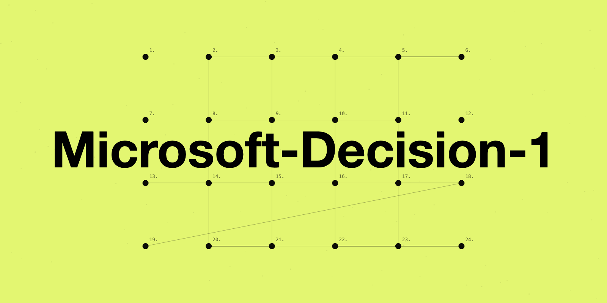

# Microsoft-Decision-1：微软官方快速决策模型（发布文全译）

> 原文：[Introducing Microsoft-Decision-1, our model for fast decision-making](https://commandline.microsoft.com/microsoft-decision-1-model-foundry/) · Microsoft Command Line（官方博客） · Achint Srivastava · 2026-10-09
>
> 译文为社区学习用途的非官方中文翻译，版权归原作者所有。官方 3 段演示视频已随条目本地收录，可直接播放。

---

## 作者与来源

**Achint Srivastava**，微软 CTO 办公室软件工程 VP。发布平台是微软官方博客 Command Line（即原文标题里的「Microsoft Decision-1 Model Foundry」：模型已在 **Microsoft Foundry** 上架，并可通过 **OpenRouter** 调用）。

**本库第一条巨头厂商官方决策模型条目**——此前收录的决策模型来自厂商（23 号 Cloudflare Clef）、社区团队（15 号 JevBench 生态、37 号 RSI-Jev、38 号 JEV-27B-VL）与个人研究者（25/27/31 号），微软以自营云产品形态入场，生态从「社区内战」进入「平台竞争」。两个细节：模型**后训练自 Qwen3.5-9B**（开源底座，与 35/37/38 号的底座选择同源），官方预告将改基到 Microsoft AI（MAI）与 OpenAI 底座；**定价与 Jev 官方完全一致**——输入 $0.042/百万 token、输出免费。

## 正文（全译）

决策模型正迅速成为 AI 中的一个重要新类别。与大模型（LLM）不同——LLM 为生成文本或推理复杂问题而设计——决策模型专为产出**软件可以立即执行的结构化输出**而生。一旦理解了这种能力——以极低成本、高性能完成判断与分类——各种有用的任务就都被解锁了。

今天我们发布 **Microsoft-Decision-1**：我们的快速决策打分模型，已在 Microsoft Foundry 与 OpenRouter 可用。它为**路由、分类、优先级排序、校验与工作流控制**而设计，让决策智能可以安全、可信地接入现有应用、智能体与工作流。

在我们覆盖 **36 项基准、近 15 万道题**的对比中（全部基准对训练保持盲态），Microsoft-Decision-1 取得最高准确率；同时也是实测最快的：比亚军 **Quyet-1.0-Large 快 4.5 倍**，比 **GPT-6 Sol 快 35 倍**。

### 工作原理

我们将 **Qwen3.5-9B 后训练**为快速、单次传播的决策打分模型，不久后将改基到包括 MAI 与 OpenAI 在内的其他模型。给定一组固定答案选项时，它为每个选项输出**校准过的概率分**；支持是非题、多选与评分，以及对 AI 回答和智能体动作的**量规（rubric）打分**——全部通过一次简单的结构化 API 调用完成。

打造可靠的决策模型要解决五个挑战：

**1. 速度。** 每次决策都加延迟，尤其当步骤环环相扣：20 个串行决策每步只加 100 毫秒，整个工作流就慢了两秒。Microsoft-Decision-1 的 P50 延迟比 GPT-6 Sol **快约 35 倍**。

**2. 能泛化的质量。** 对单一基准或单一任务过拟合很容易；关键是质量能否迁移到没训过的任务。我们把几十项对训练盲态的基准作为评估面，覆盖路由、排序、长上下文、多语言、分布外、推理与安全；我们还取了公开榜单 **JevBench** 上的头部模型，把它们放到另外 36 项公开与私有基准上重测——Microsoft-Decision-1 在这些更广的基准面上表现最好，泛化能力得到验证。

**3. 鲁棒性。** 等价的输入应当产生等价的决策。生产环境里，状态与指令会被改写、选项描述会变、候选项会重排、键名会换、无害的格式噪音会出现——这些都不应实质改变决策。我们对同一请求做 **8 种扰动**并统计决策翻转率：Microsoft-Decision-1 平均仅在 **1.3%** 的扰动下改变决策，其中**选项描述改写、选项逆序或乱序三种扰动下零翻转**。

**4. 概率与置信度校准。** 概率本身就是 API 的一部分，而不只是排序分。应用要用置信度决定何时执行、何时搁置、何时请求人工复查——一个 90% 的预测，在代表性样本上就该十次对九次。

**5. 安全。** 决策模型应识别有害请求，同时不误伤无害请求。我们在 11 项基准的 **5,250 个请求**上测试（覆盖有害内容、越狱尝试与提示注入），模型成功拒绝有害行为、同时保持了高可用性。

### 演示示例

分类是决策模型的关键用例。看看 Microsoft-Decision-1 对各类查询的分类，相比 GPT-6 Sol 有多准多快：

<video controls preload="metadata" src="media/demo-web-app.mp4"></video>

决策模型在计算机操作（computer use）场景同样高效。这段演示对比 Microsoft-Decision-1 与 GPT-6 Sol 完成「买一个背包」任务的速度：

<video controls preload="metadata" src="media/demo-computer-use.mp4"></video>

### 内部如何测试

以下是我们内部已经在用的一些方式，后续还会有更多。

- **数据标注**：XBOX Research 用 Microsoft-Decision-1 处理来自问卷、STEAM 和 Twitter/X 的 **10,000+ 条开放式反馈与评论**，按研究者设定的固定主题集归类，以理解玩家对不同游戏、发布与直播的讨论。结论：质量与 GPT-6 Sol 相当，**快 14 倍以上、便宜 200 倍**。
- **质量控制**：Copilot 团队用它衡量聊天与智能体回答的质量，测试发现与 GPT-5.6 Luna 水平相当、**快 100 倍**。
- **事件响应**：值班工程师用 AI 从日志、工单、通话、消息等数据源检索相关知识以响应线上事件。Microsoft-Decision-1 在知识检索上比 LLM 更好且更快。
- **科学发现**：Microsoft Discovery 实现了自适应重规划——智能体评估上一次实验、按量规得分修正方案、循环直至达成目标。Microsoft-Decision-1 打分的**一致性是 LLM 打分的 46 倍**、速度 3 倍，自适应重规划整体提速近 **4 倍**。

<video controls loop preload="metadata" src="media/demo-discovery-loop.mp4"></video>

更快、更可靠的重规划，会显著影响长时间运行的科研实验的成败。

### 候选用例

智能体控制（继续/停止/重试/交接给模型、工具或人）、模型路由（按质量成本延迟选模型）、技能内决策（按 Agent skill 规则选动作而不必重复处理长指令列表）、数据标注、AI 评审（接受/修改/拒绝）、意图分析、事件分诊路由、数据校验、推荐、搜索相关性、内容分类与过滤、代码扫描、安全筛查（放行/阻断/升级）、计算机与 UI 操作、机器人动作选择、科学发现（候选假设/化合物/实验筛选与优先级排序）。

### 开始使用

- Microsoft Foundry：https://ai.azure.com/catalog/models/Microsoft-Decision-1
- OpenRouter：https://openrouter.ai/microsoft/microsoft-decision-1

**定价**：输入 token $0.042/百万，输出免费。

### 展望

智能体 AI 已经成为现实，成本在很大程度上决定着人们如何使用 AI，为合适的任务选合适的模型也越来越重要。当智能体开始在真实世界采取行动，决策模型有潜力帮助人们引导和控制这些智能体穿越复杂环境。我们会持续更新模型，包括纳入评估与数据来进一步优化质量、置信度与成本。

### 附录：被测模型

Quyet-1.0-Large（HuggingFace chinhnc/Quyet-1.0-Large）· Surogate Rune 26B-A4B · GPT-6 Luna Decisions（OpenAI）· deck-31B · H2O-Lightning-4B · Strands-Decider 2B

---

## 译注

- **发布时点与生态意义**：这是决策模型品类首次出现**超大规模云厂商自营**的模型（Foundry 上架 + OpenRouter 分发，闭源权重）。至此生态四类玩家齐了：官方 TypeSafe（Jev）、云厂商（本文、23 号 Clef）、开源实验室与社区（37/38 号）、个人研究者（25/27/31 号）。15 号 JevBench 的「140+ 变体」还会继续膨胀。
- **所有数字为厂商自报**：36 基准/15 万题「盲态」的口径比单榜自报强，附录也公布了被测模型清单，但**无第三方复核**——与 23 号 Clef 发布文同级；对「快 35 倍」「平 GPT-6 Sol」等结论，按 **33 号**（Arena 实测）与 **30 号**（独立实测方法论）的精神，等独立复核。
- **鲁棒性数字与既有条目直接对话**：8 类扰动平均 1.3% 翻转、描述改写与乱序**零翻转**——这正是 **31 号**（顺序不变性训练）与 **35 号**（LLM2Jev 位置偏差）着力的问题，微软把它做进了官方发布文的评估面；也说明「扰动翻转率」正在成为决策模型的标配验收项（对应 **30 号**的方法论与共学演讲第 18 页的验收清单）。
- **定价完全对齐 Jev 官方**（$0.042/M 输入、输出免费）——跟随定价意味着微软把「决策模型」定价锚在 TypeSafe 的水平上，价格战暂未开打；对比 **33 号** Arena 的结论「省钱靠架构不靠单点替换」，厂商间的差异更多会体现在置信度质量与鲁棒性上。
- **底座选择**：后训练自 Qwen3.5-9B（开源），预告改基 MAI/OpenAI——「开源底座起步、自研底座接棒」与社区模型的路径一致；**35 号**论文「基座越强决策越强、微调收益靶向」的结论对它同样适用。
- **视频说明**：3 段官方演示视频（Web 应用分类对比 / 买背包 computer use 旁白演示 / Discovery 重规划循环）已随条目本地收录。原站视频直连被 Cloudflare 拦截，本库经浏览器会话取回原始 MP4（computer-use 一段 29 秒、5.4MB），页面内可直接播放。
