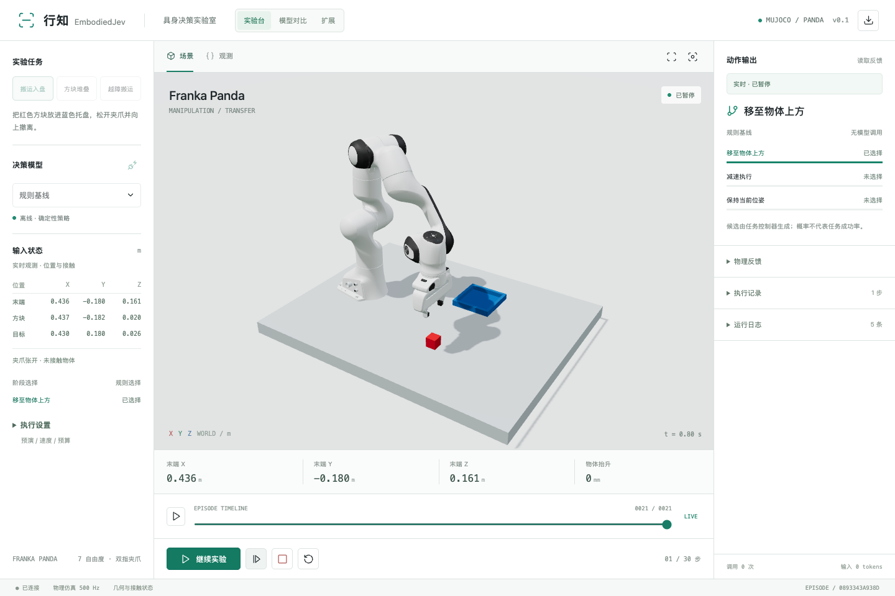
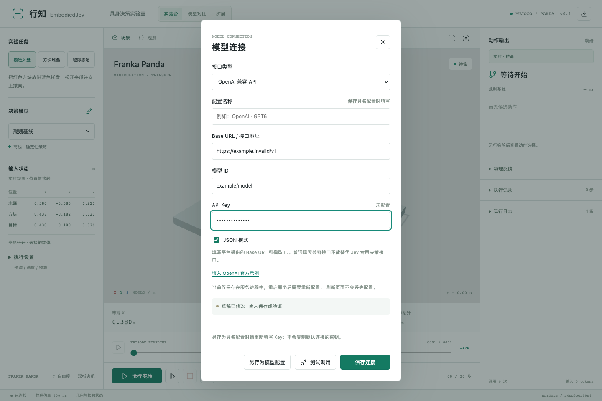
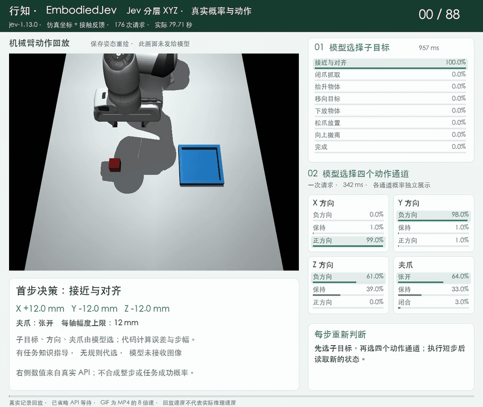
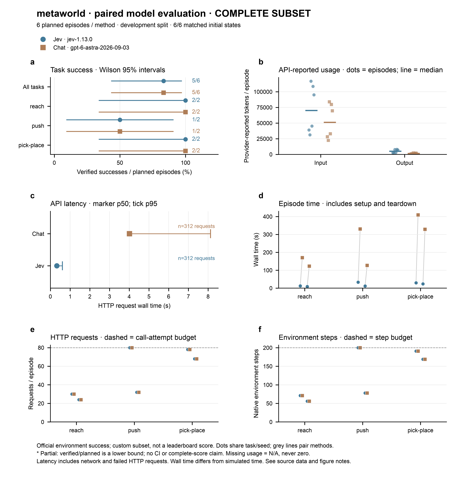
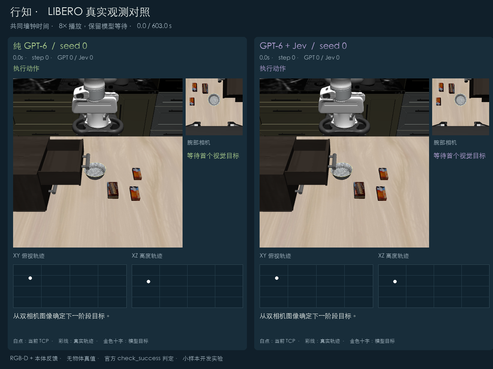

# EmbodiedJev（行知）：把 Jev 装进机械臂的决策工作台

> 原文：[GitHub FBddcz/embodied-jev README](https://github.com/FBddcz/embodied-jev) · 项目 README 整理编译 · 快照 2026-10-10
>
> 原文为中文项目，本文为知识库视角的整理介绍（重点：项目是什么、Jev 在其中怎么用、实测成绩），版权归原作者所有。代码 MIT。



## 作者与来源

**EmbodiedJev（中文名「行知」）**，GitHub [FBddcz/embodied-jev](https://github.com/FBddcz/embodied-jev)，2026-09-20 创建，267 star，Python/MIT。一句话：**MuJoCo 机械臂决策工作台**——Franka Panda 机械臂 + 三个抓放任务，模型在浏览器界面里接入，跑「观察 → 决策 → 执行 → 再观察」的闭环。不需要机器人硬件，内置规则基线可以零 API Key 先玩起来。

项目名字取自「行而有据，知而能行」：模型负责当前这一步的选择，控制器负责动作转换与执行，**成功由独立的物理条件判定**，不由模型自报。这套「选择归模型、验证归物理」的分工，是整个工作台的设计主线。

## 项目介绍

**三个仿真任务**：搬运入盘（抓红方块放蓝托盘）、方块堆叠（检查支撑与稳定）、越障搬运（抬高越障再放置）。抓取靠双侧夹爪接触判定，成功由物理状态给出。

**六种模型入口**：规则基线、本地 MiniCPM5-2B（Transformers FP16，Apple Silicon 可用 MPS）、TypeSafe Jev、OpenAI 兼容 API、Claude 原生 API、以及任何返回候选概率的「结构化决策 API」。



**几个值得单独说的设计**：候选动作先在仿真副本里预演，拦截已配置的碰撞和抓取丢失；外部相机与腕部相机可自由组合，画面在决策与动作边界采样；2–3 路模型可以用同一任务、同一种子并排对比，回放按仿真时间对齐（回放速度不代表推理速度）；实验 JSON 可导出，社区复现投稿直接挂到[在线展示页](https://fbddcz.github.io/embodied-jev/)。安全细节也做了：Key 存系统钥匙串不进浏览器存储，服务默认只监听 127.0.0.1。

## Jev 在其中的应用

### 接入形态

行知走 **TypeSafe 官方决策接口**（`https://api.typesafe.ai/v1/systemone`）：候选决策协议、直接返回概率。界面填 TypeSafe API Key 即可，模型默认 `jev-latest`（做固定版本对比可锁 `jev-1.13.0`，实验导出会记录 API 实际返回的模型名）。OpenAI 或 Anthropic 的 Key 不能接到这个入口——聊天兼容不等于支持 Jev 的决策协议。

### 两种控制模式，两种任务分解粒度

| 模式 | Jev 收到什么 | Jev 决定什么 |
|---|---|---|
| 预设技能 | 仿真状态或 RGB-D 检测坐标 + 当前可用的技能列表 | 先选阶段，再选技能动作 |
| 分层 XYZ | 仿真坐标 + 接触反馈 + 任务说明 + 几何误差 + 每轴 2–12mm 步长 | 先选子目标，再**同时**给出 X/Y/Z 方向和夹爪动作 |

关键约束：**Jev 只接收结构化文本**——它可以读坐标和视觉检测结果，不能直接吃相机图片（原始 RGB 输入只开放给支持图像的 Claude/Chat 逐步模式）。想要图像决策，就得先过一道本地 RGB-D 检测器把画面翻译成坐标。这与本库 **11 号**（typesafe-mario 的「模型该看什么」）是同一个课题：喂结构化状态还是喂原始画面，是具身场景里最要紧的接口设计。

### Jev 的实测成绩

**分层 XYZ 搬运（jev-1.13.0，仿真坐标+接触反馈）**：两局都到达终态——89 步/178 次请求/72.4 秒，88 步/176 次请求/79.7 秒。但两局在下放途中都失抓，方块落进托盘后才张爪撤离，没有主动选择 `release` 子目标。作者的结论很克制：搬运终态跑通了，**还谈不上稳定精确放置**。此前一版把 21 个候选平铺给模型的 40 步试跑直接失败（预算与接口不同，作者注明不可直接比较）。



**Meta-World 六局并排对照**（reach/push/pick-place × seed 0/1，每局最多 200 步 80 次请求）：

| 版本 | Jev | GPT-6 Astra | 费用 |
|---|---|---|---|
| 直通四通道（无分层） | **2/6** | 5/6 | – |
| 分层 v2（先子目标后动作） | **5/6** | 5/6 | **Jev $0.018 对 GPT-6 $3.605** |

两个信息：第一，分层 v2 里 Jev 与 GPT-6 战平（都只败在 `push-v3-0` 步数耗尽），但按官方单价估算，**费用差约 197 倍**；第二，Jev 在直通模式下只有 2/6，加了「先选子目标」的分层结构后拉到 5/6——**任务分解救了决策模型**。



**LIBERO 视觉对照（关抽屉）**：同一初态、同一控制接口，纯 GPT-6 与 GPT-6+Jev 各跑一局，双双成功，但**混合组费用少 81.7%（$2.15 → $0.394）、总耗时短 47.6%（609.8 秒 → 319.7 秒）**——Jev 负责局部决策，GPT-6 只在需要时被调用。



**界面对概率的诚实处理**：Jev 和结构化决策 API 有原生候选概率，界面直接显示；普通聊天 API 只返回动作选择，模型自报的「信心」**不会**被当作真实概率展示。

### 为什么用 Jev 做局部决策

作者给的理由：同一状态下把独立问题合并成一次调用、直接输出有限候选的概率，省掉重复输入和文字生成；配合几何状态压缩与 HTTP 连接复用，延迟进一步下降（本地 MiniCPM 路线则直接读候选 logits）。换算到机械臂场景：每步决策从 GPT-6 的数秒、数美元，降到 Jev 的亚秒级、万分之几美元——20 个串行步骤的差距就是分钟级和美元级的差别。

### 其他结果（同样诚实）

- 规则基线在三个任务 × 三个种子上 9/9 完成、零模型调用——**小样本上模型没赢规则策略**，作者原话写明。
- GPT-6 Astra 预设技能模式 9/9（每局 8 动作 13 次调用，单次决策平均 2.81 秒）。
- 本地 MiniCPM5-2B 最近一组 0/3（两局停滞、一局预算耗尽）。
- GPT-6 双相机视觉逐步规划：正常搬运 32 步；托盘中途移动 6cm 的扰动局 43 步重新抓取完成。失败、两次 API 超时都保留在记录里。
- 下一步是双臂 Piper 真机实验（方案阶段，未执行）。

## 快速上手

```bash
git clone https://github.com/FBddcz/embodied-jev.git && cd embodied-jev
python3 -m venv .venv && source .venv/bin/activate
python -m pip install -e . && npm ci && npm run build
embodied-jev serve --port 8090    # 打开 http://127.0.0.1:8090，规则基线零 Key 可跑
```

---

## 译注

- **「决策层省钱」在具身场景复现了**：LIBERO 关抽屉（省 81.7%）与 Meta-World（197 倍费用差）两个数字，与 **33 号**（Arena：路由省成本靠架构）、**39 号**（Microsoft-Decision-1 的 35 倍延迟优势）、Agent Harness 论文（99.5% 流量走便宜模型）是同一个结论的不同场景版本——**大模型当规划器、决策模型当局部执行判断**，这笔账在机械臂上算得尤其清楚，因为每步决策频率高、串行依赖强。
- **分层结构是 Jev 能打平 GPT-6 的前提**（2/6 → 5/6）。这呼应 **35 号**论文的高基数发现，但机制不同：LLM2Jev 显示强底座可以一次吃下 77 路候选，而这里的教训是**把「选子目标」和「选动作」拆成两级**，候选空间小了、每级的语义也更聚焦。给决策模型搭脚手架，可能比换更强的模型更划算。
- **状态表示的老课题**（**11 号**、**30 号**三连问第一问）：Jev 只吃文本，所以行知用本地 RGB-D 检测器把画面翻译成坐标——感知归程序、决策归模型的管线形态，与 14 页视觉方向分析的判断一致。Jev 两局未接收图像，三维画面只是回放。
- **记录的诚实度是这份 README 最值钱的部分**：模型没赢规则基线、下放失抓、MiniCPM 0/3、API 超时，全部原文保留——这正是 **30 号**方法论（实跑、失败全保留、只认物理判定）在项目侧的样子。作者反复标注「小样本不能推算成功率」「回放速度不代表推理速度」，引用数字时请一并带上这些限定。
- **与 37/38 号的时间线交叉**：本项目 9 月 20 日创建，比 RSI-Jev（09-22）早两天，同期的社区已经把 Jev 接进了具身控制；LIBERO 的 GPT-6+Jev 混合组算是 Agent Harness 思路（arXiv 2610.02267）在仿真机械臂上的独立复现。
